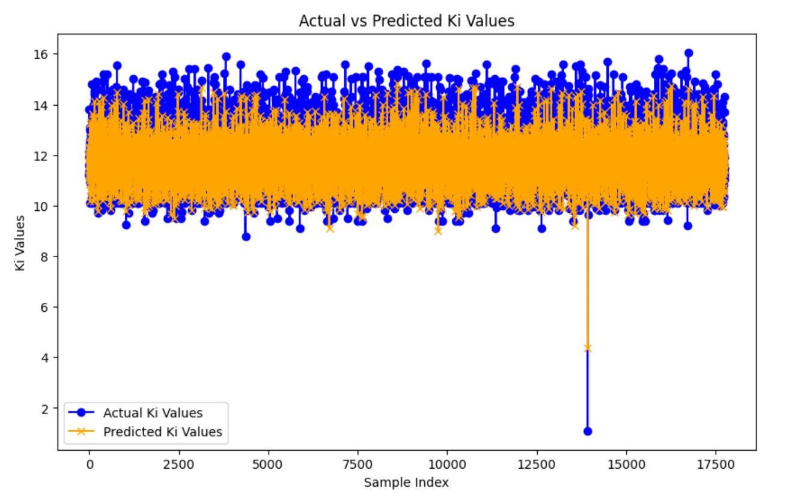

# Drug Discovery Using Neural Networks

## Project Overview
This repository hosts a machine learning pipeline designed to predict the binding affinity between ligands and proteins using their SMILES strings and protein sequences. Various neural network architectures have been employed to explore this task, optimizing predictive accuracy and computational efficiency.

## Description
This project implements multiple neural network models to predict the binding affinity (Ki) of ligand-protein pairs:
- **Custom Transformer Architecture**: Built from scratch, exploring the use of transformers in binding affinity predictions.
- **Pretrained Language Models (ChemBERT)**: Utilized Parameter Efficient Fine-Tuning (PEFT) and LoRA to fine-tune ChemBERT, achieving moderate performance.
- **ANN and GNN**: Artificial Neural Networks and Graph Neural Networks were also explored for their ability to process complex structural data.
- **CLIP Vision Transformer**: Applied OpenAI's CLIP model to convert molecular features into images, yielding the best performance with an RMSE of 0.82. After comparing various models, the Vision Transformer has been found to work better than all other approaches due to its ability to effectively process and integrate complex visual and sequential data for drug-protein interactions.

## Dataset
The dataset used in this project contains three main types of data:
- **SMILES of Ligands**: Chemical structure representations in SMILES format for various ligands.
- **Protein Sequences**: Sequences of amino acids in proteins that interact with the ligands.
- **Binding Affinity (Target Variable)**: Quantitative measure of the strength of the ligand-protein interaction, which serves as the target variable for model predictions.

## Repository Content
- `Dataset/`: Contains the dataset used for training and testing the models, including SMILES strings, protein sequences, and their respective binding affinities.
- `Other attempts/`: Includes Jupyter notebooks for each model attempt such as ANN, GNN, full fine-tuning of ChemBERT, and PEFT applications.
- `Vision Transformer.ipynb`: Jupyter notebook detailing the application of the CLIP Vision Transformer model which provided the best results.

## Installation
To use this repository:
- git clone https://github.com/your-github-username/Drug-Discovery-Using-Neural-Networks.git
- cd Drug-Discovery-Using-Neural-Networks
- pip install -r requirements.txt

## Usage
Each Jupyter notebook in the repository is self-contained with instructions and code to run the models:

## Results
- The CLIP Vision Transformer model outperformed other models with an RMSE of 0.82.
- Detailed performance analysis and comparisons are available within each notebook in the `Other attempts/` folder.
- Results of Clip Vision Transformer:
  

